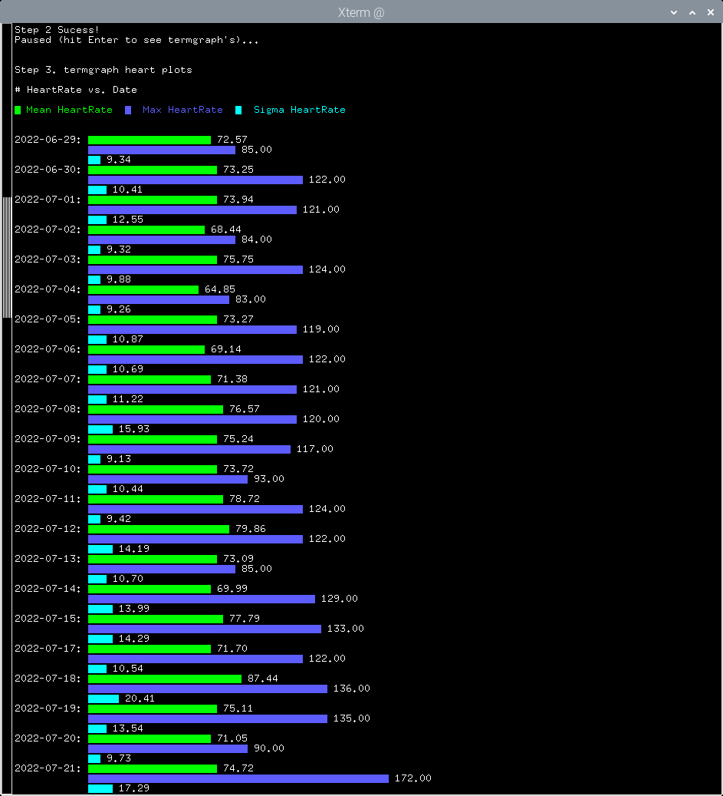
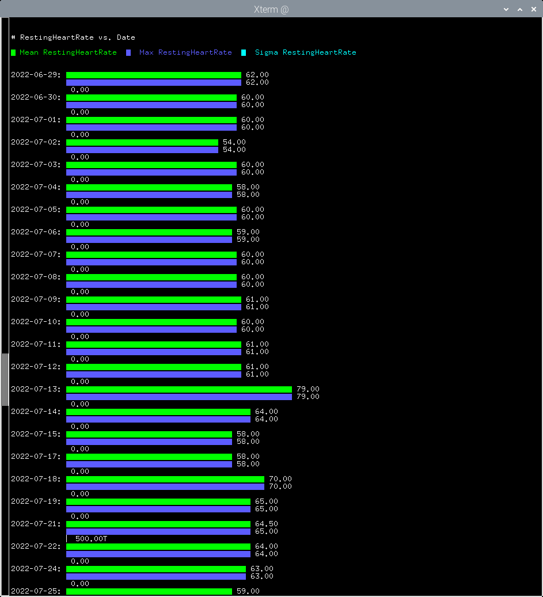
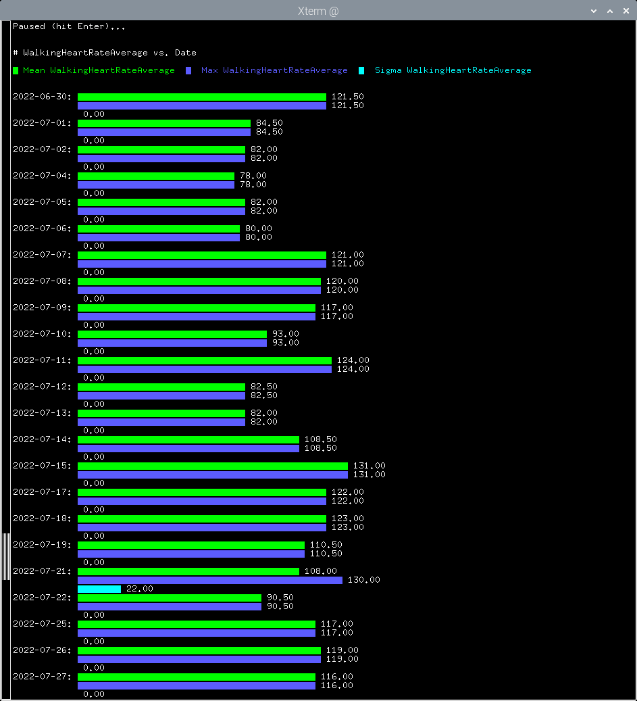
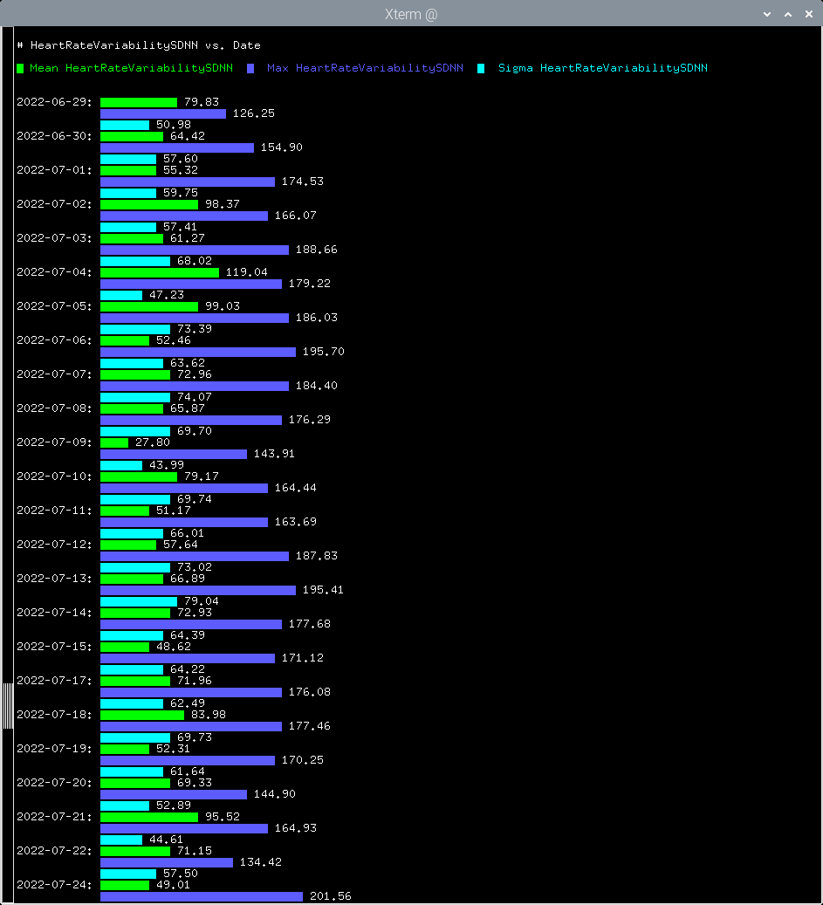
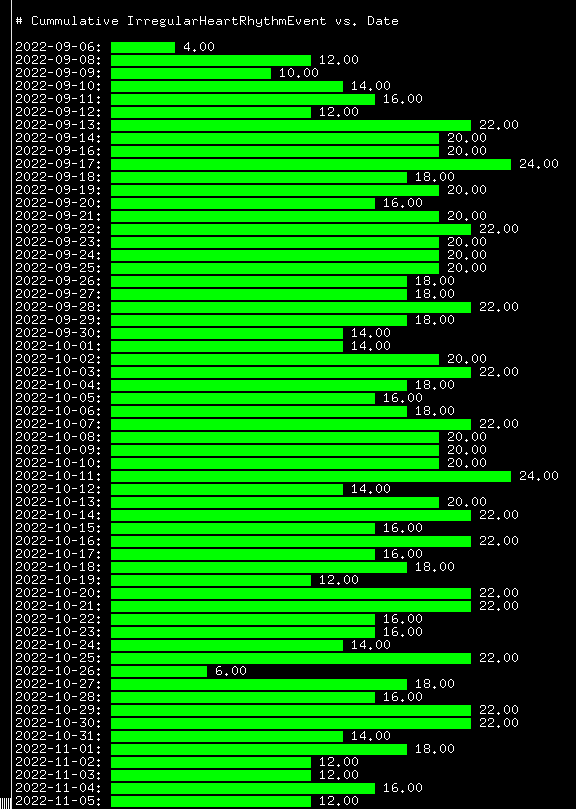

# apple_health_parse

**Parse the export.xml apple health file into raw data .csv files.**

        All xml files are limited by their verbosity.  This makes them overly
        complex, especially when you want just to extract the raw data. At
        least the way Apple uses xml files.

        I spent three weeks trying to understand a python version: 
        https://github.com/kdesch5000/AppleHealthData/blob/master/parsehealth.py

        Why make my own parser when one is available?
        Well 3 weeks ago and 3 iPhone OS updates and as many apple watch 
        updates plus moving to series 8 watch from series 7; the python
        version broke.  Also the python version didn't extract all of the data
        available. 

        The python code is short at around 200 lines. The awk code is about
        twice that.  But I did not count the libraries that python loads
        (xml.etree.ElementTree, pandas, datetime).

        After fumbling with python and xml for 3 weeks, in 6 hours I had the
        awk version.  I did skip the Activity Summary section because the tools
        on the iPhone do an adequate job. If anybody can get the python to work
        for the changes Apple hass made please let me know.

**Install**
        Put the apple_health_parse.awk file in a directory that is in the
        environment variable AWKPATH.  Then just run the bash script ahp .

**Disclaimer**
        I am not a doctor.  See one if your watch indicates a serious condition.

        Note: My watch kept indicating that I had AFIB. I went to that doctor
        and confirm this with more tests than were needed, but hey that is what
        insurance is for.

        After comparing multiple AFIB screen shots to the data I determined that
        this AFIB data was call Irregular Heart Rhythm Event in the xml. Apple does
        have some documentation on this.
        https://developer.apple.com/documentation/healthkit/hkcategorytypeidentifier/3081269-irregularheartrhythmevent

**Some Other termgraph plots**

**Data Generated**
        Between the iPhone/watch updates my Export AllHealth Data (export.xml)
        file is over 6 meg.  All the _tg.csv files are in random chornological
        order. Since a simple linux sort corrects this no awk code was devoted
        to correcting this.

        The remaining csv files are in chornological order. And can be used
        with other plotters or spreadsheets.
        I just wanted something quick.
